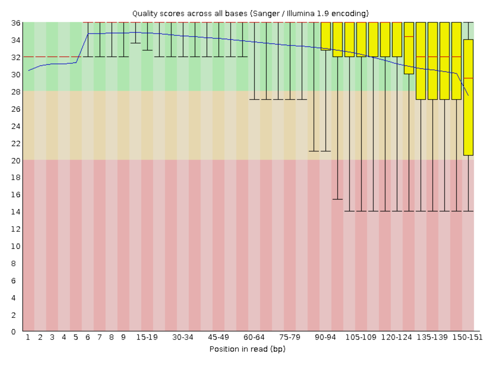

```{r setup, include = FALSE}
knitr::opts_chunk$set(echo = FALSE,
                      warning = FALSE,
                      message = FALSE,
                      error = TRUE)
```

# Background and Overview

What happened in the Amazon and São Paulo during the COVID-19 pandemic? 

This exploratory analysis of three epidemiological and one genetic data sets begins by showing that the city of Manaus, and its Northern Brazilian state, Amazonas, were hit harder per capita than the city and state of São Paulo through the second and third quarters (Q2; Q3) of 2020.

From Q2 into Q3, the intense period of infection correlated with the emergence of an antibody prevalence among Manaus blood donors that was approximately threefold greater than antibody prevalence among São Paulo blood donors [Figure 4; @Buss2020.09.16.20194787]. This was an indication of good news and herd immunity for Manaus, heading into Q4. But the path to that antibody prevalence was characterized by a two- to three-fold increase in mortality for Manaus residents, especially those that were male and over 65 [Figure 6; @Prowse2020.09.25.20201939]. Over half of Manaus men aged 65-70 died.

Genetic data contributed one more distinct, undeniable trend for the Amazon. A variant call analysis of 33 SARS-CoV-2 samples from patients across the Northern Brazilian states surrounding Manaus showed that the great majority of single nucleotide polymorphisms (SNPs) displayed transitions from thymine to cytosine (Figure 8).

# Methods

## Software

[Rstudio 4.0.2](https://rstudio.com/) and [Ubuntu 20.04](https://ubuntu.com/) powered three novel analyses of public tabular data (Figures 1-6), alongside a variant call analysis based on code by [Naupaka Zimmerman](https://github.com/naupaka) (Figures 7-8).

The pre-print data browsing tool `medrxivr` contributed to the initial exploration of tabular data, as did `OxCOVID19` [@McGuinness; @Mahdi]. Hadley Wickam wrote and co-wrote several R packages that supported data reading, tidying, filtering, and formatting [@dplyr; @tidyr; @readr; @lubridate]. His invaluable `ggplot2` package rendered Figures 1-6 and Figure 8, with help from `ggthemes`. [@ggplot2; @ggthemes]. Figure 7 is a screenshot from variant call analysis made possible by VCFR [@VCFR].

## Tabular data methods

Throughout 2020, Oxford University hosted and made freely accessible large amount of tabular epidemiological COVID-19 data from across the world [@Mahdi]. This provided the demographics and case rates data of Manaus and São Paulo (Figures 1-3).

Buss and colleagues inferred elevated levels of herd immunity in Manaus from their tabular data, which included antibody prevalence [Figure 4; @Buss2020.09.16.20194787]. Figure 4 collapses multi-week date ranges to a single data point per month. The source data include specific dates, as well as antibody prevalence values before and after adjusting for seroreversion over time. For full details, refer to Table 1 of Buss and colleagues' pre-print paper [@Buss2020.09.16.20194787].

Prowse and colleagues also reported on herd immunity in the Amazon and Northern Brazil, providing risk factor data, including mortality by age and sex [Figures 4-5; @Prowse2020.09.25.20201939].

## Genetic data methods

Across Q2 and Q3 of 2020, scientists across Norhtern Brazil and the Amazon collected 33 Illumina NGS samples and posted them as `.fasta` files on the website of the National Center for Biotechnology Information (NCBI) under the project number [PRJNA662684](https://www.ncbi.nlm.nih.gov/bioproject/PRJNA662684).

Within a [Makefile](https://www.gnu.org/software/make/manual/make.html), quality checking scripts demonstrated the high quality of the majority of this data. Next, a trimmomatic script based on code by [Data Carpentry](https://datacarpentry.org/wrangling-genomics/03-trimming/index.html) removed the shorter, lower quality runs from the analysis. Several more bash scripts based on code by [C. Titus Brown and colleagues](https://angus.readthedocs.io/en/2017/variant-calling.html) compared the reads to the NCBI's reference SARS-CoV-2 genome to output a `.vcf` variant call format file for interpretation in RStudio. Lastly, single nucleotide polymorphisms (SNPs) were checked for quality (Figure 7) and grouped by position and nucleotide substitution (Figure 8).

# Results and Discussion

## Tabular data analysis

Cities like Manaus track and report mortality on an ongoing basis, setting a baseline for deaths per week. Excess mortality is the observed number of deaths, minus the baseline expected mortality. Mortality is measured in deaths per 1000 people.

Prowse and colleagues reported that Manaus was the most quickly and severely hit city in the hardest hit region of the Amazon/Northern Brazil [Figure 4; @Prowse2020.09.25.20201939]. OxCOVID19 data corroborated this, showing that Manaus was hit much harder per capita than São Paulo [Figure 1-3; (OxCOVID19)](https://covid19.eng.ox.ac.uk/). Buss and colleagues contributed antibody prevalence data consistent with the herd immunity interpretation [Figure 4; @Buss2020.09.16.20194787].

Prowse and colleagues showed that total female mortality (996) was more than double (2.13x) expected mortality (468) in the oldest age group of patients, over 75 [not pictured; @Prowse2020.09.25.20201939]. In fact, the situation was worse for slightly younger female patients, ages 65-70, who faced a total mortality (283) 2.78x expected mortality (102) [Figure 5; @Prowse2020.09.25.20201939].

In contrast, total male mortality (1208) were higher in raw numbers, as well as in proportion (3.16x) to expected mortality (382) in the oldest age group of patients, over 75 [not pictured; @Prowse2020.09.25.20201939]. The ratio of expected (149) to observed mortality (510) was most severe at 3.42x in men, ages 65-70 [Figure 6; @Prowse2020.09.25.20201939]. Men in this age group died at 1.80 times the rate of women of the same age group. In percentage terms, 51.0% of men and 28.3% of women ages 65-70 died by the end of Q2 in Manaus.

In summary, living in Manaus, being over 65, and being male correlated with elevated case rates, antibody prevalence, and mortality for Brazilians facing COVID-19 in Q2 and Q3 of 2020.

## Genetic data analysis

Typical read quality was high across the 33 SARS-CoV-2 samples in the the Northern Brazil NCBI project analyzed
0 (Figure 7).

The majority of single nucleotide polymorphism mutations (SNPs) among Brazilian sample genomes were pyrimidine transitions from thymine to cytosine (Figure 8). Contextualizing this clear trend could be a fruitful direction for further discovery.

 ```{r load-packages-and-functions}
# These functions are also listed in DESCRIPTION for .travis.yml
library("vcfR")
library("ggplot2")
library("dplyr")
library("tidyr")
library("readr")
library("ggthemes")
library("medrxivr")
library("oxcovid19")
library("lubridate")

# this loads all function files in the code/functions directory
function_paths <- list.files("code/functions", full.names = TRUE)
purrr::walk(function_paths, source)
```

```{r load-vcf-data}
# load in, tidy, and stack all of the VCF files in the target directory
# these are the output of the bash pipeline
stacked_vcfs <- parse_tidy_and_stack_vcfs(
  vcf_dir_path = params$vcf_dir_path)

# load in the gff file with genome annotations for SARS-CoV-2
gff <- read_gff(gff_file_path = params$gff_file_path)

# pull out just the named genes from the annotation file
gene_table <- extract_genes_from_gff(annotation_object = gff)

# combine the stacked vcf table with the gene names and the metadata from
# the sra runtable file
vcf_with_metadata <- add_genes_metadata_to_vcfstack(
  sra_runtable_path = params$sra_runtable_path,
  stacked_vcf = stacked_vcfs,
  cleaned_genes_table = gene_table)
```

```{r load-confirmed-data}
# OxCOVID19 confirmed cases setup
# this loads all function files in the code/functions directory
function_paths <- list.files("code/functions", full.names = TRUE)
purrr::walk(function_paths, source)

## Step 1: Create a connection to OxCOVID19 PostgreSQL server
con <- connect_oxcovid19()

## Step 2: Access epidemiology table from OxCOVID19 PostgreSQL server
epi_tab <- get_table(con = con, tbl_name = "epidemiology")

## Step 3: Query the epidemiology table to show data for Brazil
bra_epi_tab <- dplyr::filter(.data = epi_tab, countrycode == "BRA", adm_area_1
                             %in% c("Amazonas", "São Paulo"))
```

# Figures

```{r confirmed-plot}
# produce a colored line plot of confirmed cases by state
confirmed_plot <- bra_epi_tab %>%
  group_by(date) %>%
  ggplot(aes(x = date,
             y = confirmed)) +
  geom_line(aes(colour = adm_area_1)) +
  labs(title = "Confirmed COVID-19 cases over time",
       x = "Date",
       y = "Confirmed Cases",
       color = "State") +
  theme_clean()

confirmed_plot

ggsave(plot = confirmed_plot,
       filename = "output/figures/confirmed_plot.png")
```

**Figure 1**: The state of São Paulo saw more total confirmed cases than the state of Amazonas.

```{r population-plot}
# produce a pie chart highlighting São Paulo and Amazonas vs Total
population_path <- readr::read_csv("data/raw_data/Brazil_populations.csv")
population_data <- population_path %>%
  group_by(population) %>%
  dplyr::filter(RegionName %in% c("Amazonas", "São Paulo", "Total"))

# Remove Amazonas and São Paulo populations from Total
population_data[3, 3] <- (population_data[3, 3]
                         - population_data[2, 3]
                         - population_data[1, 3])

# Basic pie chart
population_plot <- ggplot(population_data,
                          aes(x = "", y = population, fill = RegionName)) +
  geom_bar(stat = "identity", width = 1, color = "white") +
  coord_polar("y", start = 0) +
  labs(title = "Population of Brazil", color = "State") +
  theme_void() # remove background, grid, numeric labels

population_plot

ggsave(plot = population_plot,
       filename = "output/figures/population_plot.png")
```

**Figure 2**: The state of São Paulo is much larger than Amazonas by population at 46 million versus 4 million.

```{r per-capita-plot}
# produce a dual line plot of confirmed cases by state, Amazonas or São Paulo
per_capita_amazonas <- bra_epi_tab %>%
  dplyr::filter(adm_area_1 == "Amazonas") %>%
  group_by(date) %>%
  # divide by population for per capita
  dplyr::mutate(per_capita_a = confirmed / 4207714) %>%
  dplyr::select(date, per_capita_a)

per_capita_sp <- bra_epi_tab %>%
  dplyr::filter(adm_area_1 == "São Paulo") %>%
  group_by(date) %>%
  # divide by population for per capita
  dplyr::mutate(per_capita_s = confirmed / 46289333) %>%
  dplyr::select(date, per_capita_s)

# per_capita_amazonas
# per_capita_sp
per_capita_plot <- ggplot() +
  geom_line(data = per_capita_amazonas, aes(x = date,
                                          y = per_capita_a,
                                          color = "Amazonas")) +
  geom_line(data = per_capita_sp, aes(x = date,
                                    y = per_capita_s,
                                    color = "São Paulo")) +
  labs(title = "Confirmed COVID-19 cases per capita over time",
       x = "Date",
       y = "Confirmed Cases Per Capita",
       color = "State") +
  theme_clean()

per_capita_plot

ggsave(per_capita_plot,
       filename = "output/figures/per_capita_plot.png")
```

**Figure 3**: Amazonas saw greater confirmed cases per capita than São Paulo.

```{r prevalence-plot}
# produce a dual-line plot of seroreversion adjusted prevalence of SARS-CoV-2
# antibodies across Manaus and São Paulo
prevalence_data <- readr::read_csv("data/raw_data/Adjusted_prevalence.csv") %>%
  tidyr::pivot_longer(!date, names_to = "region")
prevalence_plot <- prevalence_data %>%
  ggplot() +
  geom_line(aes(x = date, y = value, color = region)) +
  labs(title = "Prevalence of SARS-CoV-2 antibodies (seroreversion adjusted)",
       x = "Month",
       y = "Antibody prevalence (% of population)") +
  scale_color_manual("City",
                     labels = c("Manaus", "São Paulo"),
                     values = c("cyan", "red")) +

  theme_clean()

ggsave(plot = prevalence_plot,
       filename = "output/figures/prevalence_plot.png")

prevalence_plot
```

**Figure 4**: Manaus saw more widespread prevalence of SARS-CoV-2 antibodies vs. São Paulo, up to 66% vs. 22% of the population respectively.

```{r mortality-plot-f}
# create a bar chart of female mortality in Manaus, March - June
mortality_data_f <- readr::read_csv("data/raw_data/Excess_mortality.csv") %>%
  select(-observed_mort_f, -excess_mort_total,
         -excess_mort_percent, -observed_mort_m,
         -excess_mort_m, -expected_mort_m) %>%
  tidyr::pivot_longer(!age, names_to = "mortality")


mortality_plot_f <- ggplot(data = mortality_data_f,
                           aes(x = age, y = value, color = mortality)) +
  geom_col(aes(color = mortality, fill = mortality)) +
  labs(title = "Female mortality in Manaus, March 2020 to June 2020",
       x = "Age",
       y = "Deaths per 1000") +
  scale_color_manual("Patient mortality classification",
                     labels = c("Excess mortality female",
                                "Expected mortality female"),
                     values = c("coral", "darkseagreen4")) +

  theme_clean() +

  # rotate axes: https://tinyurl.com/ydgq5nt3
  theme(axis.text.x = element_text(angle = 90, vjust = 0.5, hjust = 1))

mortality_plot_f

ggsave(mortality_plot_f,
       filename = "output/figures/mortality_plot_f.png")

```

**Figure 5**: Excess mortality in women peaked at 2.78x times expected mortality in the age group 65-70 years, with a total mortality of 283 deaths per 1000 residents of Manaus.

```{r mortality-plot-m}
# create a bar chart of male mortality in Manaus, March - June
mortality_data_m <- readr::read_csv("data/raw_data/Excess_mortality.csv") %>%
  select(-observed_mort_f, -excess_mort_total,
         -excess_mort_percent, -observed_mort_m,
         -excess_mort_f, -expected_mort_f) %>%
  tidyr::pivot_longer(!age, names_to = "mortality")


mortality_plot_m <- ggplot(data = mortality_data_m,
                           aes(x = age, y = value,
                               color = mortality)) +
  geom_col(aes(fill = mortality)) +
  labs(title = "Male mortality in Manaus, March 2020 to June 2020",
       x = "Age",
       y = "Deaths per 1000") +
  scale_color_manual("Patient mortality classification",
                     labels = c("Excess mortality male",
                                "Expected mortality male"),
                     values = c("coral", "turquoise")) +

  theme_clean() +

  # rotate axes: https://tinyurl.com/ydgq5nt3
  theme(axis.text.x = element_text(angle = 90, vjust = 0.5, hjust = 1))

mortality_plot_m

ggsave(mortality_plot_m,
       filename = "output/figures/mortality_plot_m.png")
```

**Figure 6**: Excess mortality in men peaked at 3.42 times expected mortality in the age group 65-70 years, resulting in a total mortality of 510 deaths per 1000 residents of Manaus. Men in this age group died at 1.80 times the rate of death for women of the same age group.



**Figure 7**: A typical fastq sample of SARS-CoV-2 from Northern Brazil showed high read quality, with most reads scoring above 26.

```{r snps-plot}
# Create a plot showing the distribution of SNPs by position, ref, alt
snps_data <- vcf_with_metadata %>%
  select(pos, ref, alt)

# Combine sets
ref_alt <- snps_data %>% tidyr::pivot_longer(!pos, names_to = "ref_or_alt")

# Plot SNP tally by location, ref, nuc
snps <- ggplot(data = ref_alt, aes(x = pos, y = value, color = ref_or_alt)) +
  geom_point(aes(color = ref_or_alt)) +
  labs(title = "Single nucleotide polymorphisms in the SARS-CoV-2 genome",
       x = "Position in genome",
       y = "Nucleotide") +
    scale_color_manual("Sample",
                     labels = c("Reference genome \n(Wuhan, China)",
                                "Project genomes \n(Northern Brazil)"),
                     values = c("coral", "turquoise")) +
  theme_clean()
snps

ggsave(snps,
       filename = "output/figures/SNP_pos_and_nuc.png")
```

**Figure 8**: The majority of single nucleotide polymorphism mutations among Brazilian sample genomes were transitions from thymine to cytosine.

# Sources Cited
